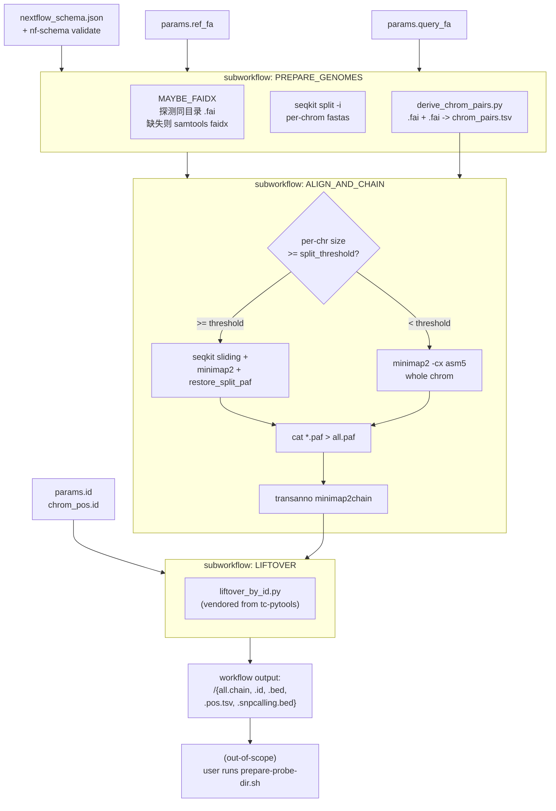

# nf-liftover 升级规划

> 目标：把现在 5 步手工流程（seqkit 拆分 → 写染色体对应表 → 选择 whole/split 跑 nextflow → liftover_by_id → prepare-probe-dir）的**前 4 步**收敛成 nf-liftover 仓库内的单一自包含 Nextflow 26 流水线：一条 `nextflow run` 输入 ID 文件 + 两个基因组，输出 `chain` 与 lifted `ID/BED/snpcalling.bed`。
>
> `prepare-probe-dir.sh` 暂不纳入本次升级，仍由用户在流水线之后手工执行。
>
> 同时把 nextflow24 的写法（`baseDir`、`check_max` 闭包、`publishDir`、手写 help/参数校验）迁移到 nextflow26（DSL2 strict、`projectDir`、`nf-schema` 校验、workflow `output:` 块、subworkflows、topic channels）。

## 升级目标

1. **更少步骤**：用户只跑一条命令；染色体拆分、对应表、whole/split 决策、liftover 全部内置（`prepare-probe-dir.sh` 暂不纳入，留给用户在流水线后手工执行）。
2. **语法升级**：从 nextflow24 升级到 nextflow26 / DSL2 strict，使用 `nf-schema`、workflow `output:` 块、subworkflows、`projectDir`、`shell = ['/bin/bash','-euo','pipefail']` 等现代写法。

## 现状痛点（来自 [docs/pipe.md](pipe.md) 与 tc-ngs-nf-utils workflows）

- **Step 1** 需要手动 `seqkit split` 两个基因组到 `split-fa/`；前缀/正则要手动写对，容易出错。
- **Step 2** 需要人工编辑 `sl4-vs-la2093` 这种 tab 分隔的对应表。
- **Step 3** 需要用户在 `align_chromosomes.nf` vs `align_chromosomes-whole.nf` 之间二选一，文档里写的 `slurm_new2` profile 在 `tc-ngs-nf-utils/workflows/nextflow.config` 里其实只有 `slurm` / `slurm_new`——长期偏差。`--ref_fai` 也必须手填。
- **Step 4** 调用另一个仓库 `tc-pytools/liftover/liftover_by_id.py`，环境是 `py3-13`，与 nextflow 流程脱节。
- **Step 5** `prepare-probe-dir.sh` 本次不纳入流水线（仍按现状由用户手工调用）。
- 用户在升级范围内只关心 "给我 ID 文件 + 两个基因组 → 给我 chain 与 lifted ID/BED/snpcalling.bed"。

## 目标用户体验（升级后）

```bash
conda activate nextflow
nextflow run /public/scripts/nf-liftover \
  --id        TCZZSL20K.id \
  --ref_fa    /public/data/genomes/solanum_lycopersicum_LA2093/S_lycopersicum_chromosomes.4.00.fa \
  --query_fa  /public/data/genomes/solanum_lycopersicum_LA2093/rename.genome.fa \
  --outdir    ./TCZZSL20K-LA2093 \
  -profile    standard \
  -resume
```

无需事先拆分、无需写对应表、无需选择 whole/split、无需切换 conda 环境。流水线结束后，用户仍按现状自行执行 `prepare-probe-dir.sh`。

## 总体架构



## 目标目录结构（nf-liftover）

- `main.nf`：顶层 `workflow { ... }`，只串子流程；含 `output:` 块定义发布。
- `nextflow.config`：`manifest.nextflowVersion = '>=26.0.0'`、`plugins { id 'nf-schema@2.2.0' }`、profiles、`conda { enabled = true }`、`process.shell = ['/bin/bash','-euo','pipefail']`。
- `nextflow_schema.json`：参数 schema（`id`、`ref_fa`、`query_fa`、`outdir`、`mapping`(可选)、`split_threshold`、`split_size`、`flank`）。
- `conf/`：
  - `base.config`（labels：`small_mem` / `medium_mem` / `large_mem`）
  - `conda.config`（labels `tool_ngs`、`tool_py`；env 名通过 `params.conda_envs` 映射到 `bioinfo` / `py-13`；`params.conda_dir` 默认 `/project/software/miniforge3`，可用 `--conda_dir` 覆盖；每个 label 同时设置 `conda` 与 `env.PATH` 双保险）
  - `slurm.config`（profiles：`slurm` 走 `normal` 队列、`slurm_new` 走 `cae` 队列；本机默认 `-profile standard` = local executor）
- `subworkflows/`：
  - `prepare_genomes.nf`
  - `align_and_chain.nf`（内部分支 whole vs split）
  - `liftover.nf`
- `modules/`：
  - `seqkit/split.nf`、`seqkit/sliding.nf`
  - `samtools/faidx.nf`
  - `minimap2/align.nf`
  - `transanno/chain.nf`（label `tool_ngs`）、`transanno/liftvcf.nf`（label `tool_ngs`）
  - `local/derive_chrom_pairs.nf`、`local/restore_split_paf.nf`、`local/liftover_by_id.nf`
- `bin/`：内置可执行脚本（Nextflow 自动加入 PATH）
  - `derive_chrom_pairs.py`（新增，按 fai 行序 + 长度匹配 query↔target）
  - `restore_split_paf.py`（从 tc-ngs-nf-utils/workflows/scripts/restore-split-paf.py 复刻并加测试）
  - `liftover_by_id.py`（从 tc-pytools/liftover/liftover_by_id.py 复刻进来，作为流水线最终 process 执行）
- `assets/`：
  - `nextflow_schema.json`、`schema_input.json`
- `examples/sl4-vs-la2093/`：可直接 `bash examples/sl4-vs-la2093/run.sh` 提交（详见下文「提交版示例」）。
- `docs/`：
  - [`pipe.md`](pipe.md)（保留现有手工流程作为 legacy reference）
  - [`upgrade-plan.md`](upgrade-plan.md)（本文件）
  - `usage.md`（升级后的一条命令使用说明）

## Nextflow 26 语法迁移要点

| 旧（nextflow24） | 新（nextflow26） |
|------------------|------------------|
| `$baseDir` / `baseDir` | `projectDir` / `workflow.projectDir` |
| 顶层 `params.help` + 手写 `log.info` help | `plugins { id 'nf-schema' }` + `validateParameters()` + `paramsHelp()` |
| `check_max(...)` 闭包 + `errorStrategy = { ... }` | 用 nf-core 风格 `conf/base.config`，或借助 `nf-schema` + 进程 `resourceLimits` |
| 多处 `publishDir` 分散在 process | 顶层 `workflow { ... output: { ... } }` 集中声明 publish 路径 |
| `Channel.fromFilePairs(..., size:-1)` 拼接对应关系 | 直接由 `derive_chrom_pairs.py` 生成 tsv，`splitCsv` 后 `combine` / `join` |
| `conda.enabled = true` 顶层 | `conda { enabled = true; useMamba = true }` 块 |
| 在 process 里硬编码 `conda '/.../envs/ngs'` | `process.withLabel: 'tool_ngs' { conda = ... }`，env 名走集中映射 |
| 默认 shell | `process.shell = ['/bin/bash', '-euo', 'pipefail']` |
| 无版本收集 | `topic: versions`，每个 process `emit: versions = ...`，最终汇总 `software_versions.yml` |
| 手写参数提示 | `nextflow_schema.json` + `paramsSummaryLog(workflow)` 开机打印 |

`manifest`：

```groovy
manifest {
  name            = 'nf-liftover'
  homePage        = 'https://example.internal/nf-liftover'
  description     = 'End-to-end liftover and chain-generation pipeline (Nextflow 26)'
  nextflowVersion = '>=26.0.0'
  version         = '0.1.0'
}
```

## 自动 whole/split 决策

在 `subworkflows/align_and_chain.nf` 中：

1. 读取 `${query_fa}.fai`（由 `samtools faidx` 在 `PREPARE_GENOMES` 内确保存在）。
2. `Channel.fromPath(fai).splitCsv(sep:'\t').map{ chrom, len -> tuple(chrom, len.toLong()) }`。
3. 与 `chrom_pairs.tsv` join 得到 `tuple(chr_a, chr_b, len_b)`，再 `branch`：
   - `large: len_b >= params.split_threshold`
   - `small: len_b <  params.split_threshold`
4. `large` 走 `SEQKIT_SLIDING → MINIMAP2_ALIGN → RESTORE_SPLIT_PAF`；`small` 直接 `MINIMAP2_ALIGN`。两路 `mix()` 后 `collectFile(name:'all.paf')` → `TRANSANNO_CHAIN`。
5. `params.split_threshold` 默认 `100_000_000`（100 Mb），可被 `--split_threshold` 覆盖。

这同时消灭了 `align_chromosomes-whole.nf` / `align_chromosomes.nf` 二选一的负担。

## 染色体对应表自动化

新增 `bin/derive_chrom_pairs.py`：

- 输入：`ref.fa.fai`、`query.fa.fai`、可选 `--mapping user.tsv`（用户覆盖）。
- 默认策略：按 fai 中的染色体顺序对齐（行 i ↔ 行 i），并对染色体长度差异 > 30% 时给出 WARNING；可选 `--by-name-suffix`（按 `chrXX` 后缀匹配）。
- 输出：`chrom_pairs.tsv`（两列：query_chrom, target_chrom）。

这样移除了原 Step 2 完全手工的环节，但保留 `--mapping` 转人工兜底。

## 入口与使用对比

升级前（前 4 步、3 个 conda、2 个仓库）：

```text
seqkit split (target)
seqkit split (query)
write sl4-vs-la2093 tsv
nextflow run align_chromosomes(-whole).nf --chr_pairs ... --species_a_dir ... --species_b_dir ... --ref_fai ... -profile slurm_new2
python liftover_by_id.py id chain ref query outdir [--split-bed ... --split-genome-fai ...]
```

升级后（1 步、1 个入口）：

```bash
nextflow run /public/scripts/nf-liftover \
  --id TCZZSL20K.id \
  --ref_fa <Q.fa> --query_fa <T.fa> \
  --outdir ./TCZZSL20K-LA2093 \
  -profile slurm_new -resume
```

升级后下游仍由用户手工执行（不变）：

```bash
sh ~/scripts/generic/probe-design/prepare-probe-dir.sh \
  TCZZSL20K-LA2093 solanum_pimpinellifolium_LA2093 TCZZSL20K -n 20
```

复杂用户仍可覆盖：`--split_threshold`、`--split_size`、`--mapping chrom_pairs.tsv`、`--flank 100`。

## 输出（workflow `output:` 块）

```groovy
output {
  directory "${params.outdir}" {
    'chain'         { from CHAIN.out         mode 'copy' }
    'liftover'      { from LIFT.out.files    mode 'copy' }
    'versions.yml'  { from VERSIONS          mode 'copy' }
  }
}
```

`LIFT.out.files` 至少包含 `<probe>.id`、`<probe>.bed`、`<probe>.pos.tsv`、`<probe>.snpcalling.bed`（由 vendored `liftover_by_id.py` 产出）。

## 已确认的环境与约束

1. **conda envs（已实地核对）**
   - `nextflow`（`/project/software/miniforge3/envs/nextflow`）：含 `nextflow 26.04.0` + `nf-test 0.9.5` + `openjdk 17`，用户跑命令前自行 `conda activate nextflow`。
   - `bioinfo`（物理 env，作为 logical `ngs`）：含 `seqkit` / `minimap2` / `transanno` / `samtools` / `bcftools` / `bedtools` / `htslib` / `fastp` / `bwa` / `blast`。
   - `py-13`（物理 env，作为 logical `py`）：含 `python 3.13` + `pandas` / `typer` / `loguru` / `pyfaidx`。
2. **逻辑名 → 物理名映射**（process 内不写死 env 名，集中映射在 `nextflow.config`，重命名只动一处）：

   ```groovy
   // nextflow.config
   params {
     conda_dir = '/project/software/miniforge3'
     conda_envs = [
       ngs : 'bioinfo',
       py  : 'py-13',
     ]
   }
   ```

   ```groovy
   // conf/conda.config
   process {
     withLabel: 'tool_ngs' {
       conda    = "${params.conda_dir}/envs/${params.conda_envs.ngs}"
       env.PATH = "${params.conda_dir}/envs/${params.conda_envs.ngs}/bin:\$PATH"
     }
     withLabel: 'tool_py' {
       conda    = "${params.conda_dir}/envs/${params.conda_envs.py}"
       env.PATH = "${params.conda_dir}/envs/${params.conda_envs.py}/bin:\$PATH"
     }
   }
   ```

   process 只写 `label 'tool_ngs'` 或 `label 'tool_py'`；以后 `py-13` 改名为 `py3-13`、`bioinfo` 改名为 `ngs`，只调 `params.conda_envs` 这一处。
3. **`params.conda_dir`** 默认 `/project/software/miniforge3`（写入 `nextflow.config`），仍允许 `--conda_dir` 覆盖。
4. **二进制路径托底（PATH 兜底）**：每个 label 同时设 `conda` 与 `env.PATH`。`env.PATH` 是 Nextflow 进程级环境变量，会注入到 `.command.sh` 中并优先于系统 PATH，因此即便 `conda activate` 没生效（shell hook 失败 / 跑流程时关闭了 conda profile），脚本仍能直接调用 `seqkit` / `samtools` / `minimap2` / `transanno` / `python`。
5. **严格 Nextflow 版本**：`manifest.nextflowVersion = '>=26.0.0'`（不放宽到 25.x），保证 DSL 行为一致。
6. **离线 nf-schema 插件**（HPC 测试时不一定有公网）：`docs/usage.md` 写明 `nextflow plugin install nf-schema@2.2.0` + `~/.nextflow/plugins/` 拷贝步骤；`nextflow.config` 钉死版本。流程同时保留极简 fallback 校验路径以便在插件缺失时仍能 `-resume` 调试。
7. **SLURM**（本机暂无，部署到 HPC 再用）：沿用 `tc-ngs-nf-utils/workflows/nextflow.config` 的写法——`profiles.slurm`（队列 `normal`）、`profiles.slurm_new`（队列 `cae`），`executor.$slurm { queueSize = 500; pollInterval = '30sec' }`。本机默认 profile 为 `standard`（local executor）。

## 输入基因组 `.fai` 自动探测

`subworkflows/prepare_genomes.nf` 中实现：

```groovy
process MAYBE_FAIDX {
  label 'tool_ngs'
  tag "${fa.name}"

  input:
  path fa

  output:
  tuple path(fa), path("${fa}.fai")

  script:
  """
  if [ -s "${fa}.fai" ]; then
      cp "${fa}.fai" "./${fa.name}.fai"
  else
      samtools faidx "${fa}"
  fi
  """
}
```

要点：

- 不在源目录写文件（避免源目录只读时报错），只在 work dir 里链接/生成。
- 用户也可以用 `--ref_fai` / `--query_fai` 显式指向自备 fai。
- 流程内部统一基于 work-dir 副本的 fai 工作，下游无副作用。

## 提交版示例（`examples/sl4-vs-la2093/`）

参考 `/public/data/genomes/solanum_lycopersicum_LA2093/` 已有的两个 fasta：

- `S_lycopersicum_chromosomes.4.00.fa`（SL4.0，作 ref/Query）
- `rename.genome.fa`（LA2093，作 target/T）

注意：上述两文件**当前同目录均无 `.fai`**，正好用来验证「探测/缺失则构建」逻辑。

`examples/sl4-vs-la2093/run.sh`（提交版，命令本身只一条 `nextflow run`）：

```bash
#!/usr/bin/env bash
set -euo pipefail

# 用户需先：conda activate nextflow

nextflow run /public/scripts/nf-liftover \
  --id        /public/data/genomes/solanum_lycopersicum_LA2093/TCZZSL20K.id \
  --ref_fa    /public/data/genomes/solanum_lycopersicum_LA2093/S_lycopersicum_chromosomes.4.00.fa \
  --query_fa  /public/data/genomes/solanum_lycopersicum_LA2093/rename.genome.fa \
  --outdir    results/TCZZSL20K-LA2093 \
  -profile    standard \
  -resume

# HPC：把上面 -profile standard 改成 -profile slurm 或 -profile slurm_new
```

附带文件：

- `examples/sl4-vs-la2093/TCZZSL20K.id`：软链 → `/public/data/genomes/solanum_lycopersicum_LA2093/TCZZSL20K.id`。
- `examples/sl4-vs-la2093/chrom_pairs.tsv`：可选；默认由 `bin/derive_chrom_pairs.py` 自动派生（行序对齐 `SL4.0ch01..12` ↔ `la2093.chr01..12`），若映射不一致再覆盖。
- `examples/sl4-vs-la2093/README.md`：一段说明 + 预期产物清单。

## 迁移与回归

1. 选取一个已跑过的旧 case（如 SL4 → LA2093）作为黄金参考，比较新旧 `all.chain` 的 MD5、`*.snpcalling.bed` 行数。
2. 保留 [`docs/pipe.md`](pipe.md) 作为 legacy 文档；新流程文档写到 `docs/usage.md`。
3. `tc-ngs-nf-utils` 中的两份 `align_chromosomes*.nf` 暂不删除；在其文件头加 `DEPRECATED: 请改用 nf-liftover`。

## 风险与待定

- `prepare-probe-dir.sh` 本次不纳入流水线；后续若希望并入，再单独立项（届时需先拿到该脚本源码并用 Python 等价重写）。
- 自动染色体对应在跨物种、染色体编号风格差异大的场景（如 `chr1` vs `1` vs `SL4.0ch01`）需用户覆盖；`--mapping` 必须保留。
- nextflow26 的 workflow `output:` 块语法仍在演进，落地时以官方 release 文档为准；如版本未稳定，回退到 `publishDir` 实现等价行为。
- 离线环境下若 `nf-schema` 插件未预置，nextflow 启动会卡在插件解析阶段。提供 fallback：若插件不可用，则退化到手写 `params.help` 与最小化参数校验（保留同样的 `--help` 文本），确保流水线仍可跑。

## Pre-flight 检查（已完成）

- [x] `/project/software/miniforge3/envs/nextflow`：`nextflow 26.04.0` + `nf-test 0.9.5`。
- [x] `/project/software/miniforge3/envs/bioinfo`：`seqkit` / `minimap2` / `transanno` / `samtools` / `bcftools` / `bedtools`。
- [x] `/project/software/miniforge3/envs/py-13`：`pandas` / `typer` / `loguru` / `pyfaidx`。
- [x] 示例输入 `TCZZSL20K.id` 已就位：`/public/data/genomes/solanum_lycopersicum_LA2093/TCZZSL20K.id`。
- [ ] HPC 测试前需把 `nf-schema@2.2.0` 离线包放到 `~/.nextflow/plugins/`（当前主机有网时首跑会自动拉取并缓存）。

## 实施 TODO 清单

按依赖顺序推进；每项完成后在本表打勾，便于追踪。

### 本轮已完成（核心难点）

- [x] **scaffold-core**：创建核心骨架：`main.nf`、`nextflow.config`、`conf/{base,conda,slurm}.config`、`nextflow_schema.json`，并在 manifest 中严格锁定 `nextflowVersion '>=26.0.0'`。
- [x] **env-map**：实现 `tool_ngs` / `tool_py` 的逻辑 label 到物理 conda env 映射，`conda` 与 `env.PATH` 双保险均已落到 `conf/conda.config`。
- [x] **helper-tests**：新增 `tests/test_core_helpers.py`，覆盖染色体对应推导与 split PAF 坐标还原。
- [x] **deriveChromPairs**：新增 `bin/derive_chrom_pairs.py`，支持 `order` / `suffix` 自动推导与用户 `--mapping` 校验复制。
- [x] **restoreSplitPaf**：新增 `bin/restore_split_paf.py`，将 `seqkit sliding` 产生的 PAF query 坐标还原回原染色体坐标。
- [x] **prepGenomes-core**：新增 `subworkflows/prepare_genomes.nf`，实现 `MAYBE_FAIDX`（同目录 `.fai` 有则引用、无则在 work dir 生成）与 `chrom_pairs.tsv` 生成。
- [x] **alignChain-core**：新增 `subworkflows/align_and_chain.nf`，实现按 ref chromosome 长度自动 whole/split，比对后合并为 `all.paf` 并生成 `all.chain`。
- [x] **liftover-core**：新增 `subworkflows/liftover.nf` 与 `bin/liftover_by_id.py` wrapper，串联现有 `tc-pytools` liftover 实现并输出 lifted 结果。
- [x] **targeted-verify**：已运行 helper 单元测试、Python 语法编译、Nextflow config 解析检查；IDE linter 未报告新增问题。

### 留给后续 AI 的简单收尾

- [ ] **schema-polish**：`nextflow_schema.json` 已创建；后续接入 `nf-schema` 的 `validateParameters()` / `paramsSummaryLog()`，并补完整 help 文案。
- [ ] **output-block**：当前核心流程为兼容性仍使用 `publishDir`；后续可按 Nextflow 26 最终语法切换到 workflow `output:` 块统一发布 `chain` / `liftover` / `versions.yml`。
- [ ] **versions**：为所有 process 增加 `versions` topic channel，汇总输出 `software_versions.yml`。
- [ ] **full-vendor-liftover**：当前 `bin/liftover_by_id.py` 是稳定 wrapper，仍调用 `/public/scripts/tc-pytools/liftover/liftover_by_id.py`；若要完全 self-contained，后续把完整脚本 vendor 进来。
- [ ] **nf-test**：接入小染色体对 + 样例 ID，作为 nf-test 黄金参考；首跑生成 chain MD5 与 `snpcalling.bed` 行数基线。
- [ ] **example**：在 `examples/sl4-vs-la2093/` 准备可一键提交的 `run.sh`（路径取自 `/public/data/genomes/solanum_lycopersicum_LA2093/`），含 `chrom_pairs.tsv`（可选）与 `README.md`。
- [ ] **usage-docs**：新写 `docs/usage.md`（含 nf-schema 离线插件预置步骤、conda env 要求）；保留 [`docs/pipe.md`](pipe.md) 作为 legacy 参考并在头部增加 DEPRECATED 提示。
- [ ] **deprecate-old-nf**：在 tc-ngs-nf-utils 的 `align_chromosomes.nf` 与 `align_chromosomes-whole.nf` 文件头加上 DEPRECATED 注释，指向 nf-liftover。

### 后续接手提示

- 最核心的数据流已经在 `main.nf` → `subworkflows/prepare_genomes.nf` → `subworkflows/align_and_chain.nf` → `subworkflows/liftover.nf` 中串好。
- 本轮核心实现为了避免 `seqkit split` 输出文件命名不稳定，采用 `samtools faidx` 按染色体抽取 fasta；只有大染色体 split 分支使用 `seqkit sliding`。如果后续仍希望保留“提前拆分全基因组目录”的形态，可在不改变下游接口的前提下替换 `prepare/align` 内部实现。
- 如果后续要继续优化并行度，优先把 `ALIGN_AND_CHAIN_PROCESS` 的 bash loop 拆成 per-chromosome process；算法逻辑可直接沿用当前实现。
- whole/split 判定使用 **ref/original FASTA** 的 `.fai` 长度，这与旧流程 `--ref_fai /Query-genome/genome.fa.fai` 的语义一致。
