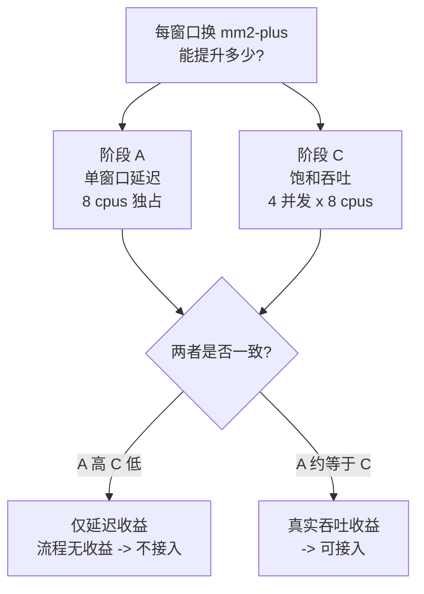

# 小麦 10 Mb 切分比对基准测试 Spec

## 背景与问题

小麦是本流程的主要场景。IWGSC v1.1 的染色体长度 473-830 Mb，全部 ≥ `params.split_threshold`（100 Mb），因此 `align_mode = auto` 一定走 split 路径：`SPLIT_REF_CHROMOSOME` 按 `params.split_size = 10_000_000` 切窗口，每个窗口作为一个 `ALIGN_SPLIT_WINDOW` 任务，用 `split_mem`（8 cpus）对着**整条 query 染色体的 `.mmi`** 比对。

规模：

| 项 | 值 |
| --- | --- |
| ref | `/public/data/genome/wheat_iwgsc_v1.1/genome.fa`（`chr1D` = 495,453,186 bp） |
| query | `/public/data/genome/triticum_aestivum_cs2.1/genome.fa`（`1D` = 498,638,509 bp） |
| chr1D 窗口数 | 50（49 × 10 Mb + 1 × 5.45 Mb） |
| 全基因组（21 条，14.07 Gb） | **1418 个窗口** |

要回答的问题：**每个 10 Mb 窗口换成 mm2-plus 能提升多少。**

## 关键设计点：延迟提升 ≠ 流程提升

前一轮水稻基准（`docs/mm2plus-benchmark-spec.md`）测到一个必须在小麦场景里区分开的事实：mm2-plus 与 minimap2 的 **total CPU time 几乎相同**（58.1s vs 57.9s），它的 wall time 收益完全来自把 chaining 段摊到额外线程上（CPU 101% → 121%，仅 mapping 段 105% → 227%）。

这意味着：

- **单窗口孤立跑**（核心有空闲）：mm2-plus 用更多线程换更短 wall time，会有提升。
- **流程真实状态**（1418 个窗口排队，核心被占满）：吞吐由总 CPU work 决定。如果总 CPU work 没减少，多线程只是在抢已经饱和的核，流程总时长可能**几乎不变**。

所以本基准必须同时测两个数，缺一不可：



只测阶段 A 会高估收益;只测阶段 C 会看不到收益来源。

## 目标

1. 量化单个 10 Mb 窗口在 `split_mem`（8 cpus）下 minimap2 vs mm2-plus 的 wall time / CPU% / RSS。
2. 量化核心饱和时（多窗口并发）两工具的批量吞吐差异。
3. 量化每窗口的 `.mmi` 加载固定开销，判断 `split_size` 是否有独立优化空间。
4. 确认窗口级 PAF 输出一致性。

## 非目标

不改流程代码，不跑完整 Nextflow 流程，不做全基因组 1418 窗口全量比对。产物只落 `/project/tmp/wheat-split-bench/`。

## 已验证前提（无需重测）

- `mm2plus 1.3` 在 `/project/software/miniforge3/envs/mm2plus`，自动分发到 `mm2plus.avx512`；启动器提示只写 stderr，`> out.paf` 安全。
- 本机 minimap2 = `2.31-r1302`，正是 mm2-plus 的上游基线。
- **`.mmi` 索引两工具 byte-identical**（已用水稻 45 Mb 染色体验证：`minimap2 -x asm5 -d` 与 `mm2plus -x asm5 -d` 产物 `cmp` 完全相同，且 mm2plus 能正常读 minimap2 建的索引）。因此：
  - 两工具可以共用同一个 `.mmi`，比对阶段的对比不会被索引差异污染；
  - 若将来接入，`BUILD_QUERY_MMI` 不必跟着换二进制。

## 执行脚本

已准备好在 `/project/tmp/wheat-split-bench/`：

| 脚本 | 作用 | 预计耗时 |
| --- | --- | --- |
| `prep.sh` | 提取 chr1D / 1D，建 query `.mmi`，按流程逻辑生成 50 个窗口 FASTA | 10-20 min |
| `phaseA.sh` | 单窗口延迟对比（6 个代表窗口 × 2 工具，含预热与顺序交替） | 15-30 min |
| `phaseB.sh` | `.mmi` 加载固定开销（10 kb dummy query） | < 2 min |
| `phaseC.sh` | 饱和吞吐对比（8 窗口批量，4 并发 × 8 cpus = 32 核占满） | 15-30 min |

按顺序执行，每步产物独立：

```bash
cd /project/tmp/wheat-split-bench
bash prep.sh   2>&1 | tee prep.log
bash phaseA.sh 2>&1 | tee phaseA.log
bash phaseB.sh 2>&1 | tee phaseB.log
bash phaseC.sh 2>&1 | tee phaseC.log
```

跑完把四个 `.log` 和 `summary_*.tsv` 回传即可。

## 阶段 A：单窗口延迟

复刻 `ALIGN_SPLIT_WINDOW` 的实际命令（`ext.args = '-cx asm5 --cs'`，`task.cpus = 8`，target 是 query 的 `.mmi`）：

```bash
minimap2 -cx asm5 --cs -t 8 cs21.1D.mmi w<NN>.fa > w<NN>.mm2.paf
mm2plus  -cx asm5 --cs -t 8 cs21.1D.mmi w<NN>.fa > w<NN>.mm2plus.paf
```

窗口取 6 个覆盖不同区域特征（染色体两端基因密集区、臂中部、着丝粒附近高重复区、末尾非满窗）：`w01 w13 w25 w38 w49 w50`。

两个控制手段：

- **预热**：正式计时前先跑一次 `w01`（丢弃结果），让 500 MB 级 `.mmi` 进入 page cache，避免第一个被计时的工具吃冷缓存惩罚。
- **顺序交替**：奇数窗口先 minimap2 后 mm2plus，偶数窗口反序，抵消缓存与机器负载漂移。

## 阶段 B：索引加载固定开销

每个窗口任务都要重新加载整条 query 染色体的 `.mmi`（约 1 GB 量级），chr1D 一条就要付 50 次，全基因组 1418 次。用一个 10 kb dummy query 测这个下界：

```bash
minimap2 -cx asm5 --cs -t 8 cs21.1D.mmi tiny.fa > /dev/null
mm2plus  -cx asm5 --cs -t 8 cs21.1D.mmi tiny.fa > /dev/null
```

若加载开销占单窗口 wall time 比例可观，则 `split_size` 调大（窗口变少）是一条与换 aligner 无关、且不改代码的独立优化路径，需要在结论里单独指出。

## 阶段 C：饱和吞吐（决定性）

模拟流程真实状态：本机 32 核，`split_mem = 8 cpus` → 4 个窗口任务并发即占满。取 8 个窗口作一批，`xargs -P 4` 跑完整批，计**批量 wall time**：

```bash
printf '%s\n' w01 w07 w13 w19 w25 w31 w38 w44 \
  | xargs -P 4 -I{} sh -c '<bin> -cx asm5 --cs -t 8 cs21.1D.mmi {}.fa > {}.<tool>.paf 2>{}.<tool>.err'
```

两工具各跑一批，前后各留一次预热。吞吐比 = `minimap2 批量 wall / mm2plus 批量 wall`。

判读要点：若阶段 A 的单窗口加速明显（比如 1.3x）而阶段 C 的批量加速接近 1.0x，说明收益只是"借空闲核降延迟"，在 1418 个窗口排队的真实流程里不成立。

## 正确性校验

窗口级 PAF 跨工具对比（沿用上一轮结论：记录顺序可能不同，内容应一致）：

```bash
for w in w01 w13 w25 w38 w49 w50; do
  cmp <(sort ${w}.mm2.paf) <(sort ${w}.mm2plus.paf) \
    && echo "$w sorted identical" || echo "$w DIFFERS"
  awk -v w=$w '{m+=$10;b+=$11} END{printf "%s\trecords=%d\taln_len=%d\tidentity=%.6f\n", w, NR, b, m/b}' ${w}.mm2.paf
  awk -v w=$w '{m+=$10;b+=$11} END{printf "%s\trecords=%d\taln_len=%d\tidentity=%.6f\n", w"(plus)", NR, b, m/b}' ${w}.mm2plus.paf
done
```

注意：窗口 PAF 后续要经 `restore_split_paf.py` 还原坐标再合并，因此窗口级只要求内容一致，不要求字节一致。

## 结果记录模板

### 阶段 A：单窗口延迟

| 窗口 | 区域特征 | minimap2 wall | CPU% | RSS | mm2plus wall | CPU% | RSS | 加速比 | PAF 一致 |
| --- | --- | --- | --- | --- | --- | --- | --- | --- | --- |
| w01 | 端部 | | | | | | | | |
| w13 | 臂中 | | | | | | | | |
| w25 | 着丝粒附近 | | | | | | | | |
| w38 | 臂中 | | | | | | | | |
| w49 | 端部 | | | | | | | | |
| w50 | 末尾 5.45 Mb | | | | | | | | |

汇总：加速比 min / 中位数 / max；单窗口平均节省秒数。

### 阶段 B：加载开销

| 工具 | dummy query wall | 占单窗口中位 wall 比例 |
| --- | --- | --- |
| minimap2 | | |
| mm2plus | | |

### 阶段 C：饱和吞吐

| 工具 | 8 窗口批量 wall（-P 4，每个 -t 8） | 等效每窗口 | 吞吐比 |
| --- | --- | --- | --- |
| minimap2 | | | — |
| mm2plus | | | |

### 外推

| 指标 | minimap2 | mm2plus | 差值 |
| --- | --- | --- | --- |
| chr1D（50 窗口）预计 wall | | | |
| 全基因组（1418 窗口）预计 wall | | | |

外推用阶段 C 的等效每窗口时间（饱和口径），不要用阶段 A 的孤立口径。

## 判定标准

- **接入**：阶段 C 吞吐比 ≥ 1.3x，且窗口 PAF 内容一致，单窗口 RSS 在 `split_mem`（16 GB × attempt）内。
- **有条件接入**：阶段 C 在 1.1-1.3x → 只在核心不饱和的场景（如 HPC 上窗口数少于可用槽位）有意义，需结合 slurm 实际排队情况再判。
- **不接入**：阶段 C ≤ 1.1x，即使阶段 A 表现好，也说明是借空闲核降延迟，流程无收益。
- 独立结论：若阶段 B 显示加载开销占比 > 20%，无论 aligner 是否更换，都应单独提 `split_size` 调优议题。

## 风险与备注

- v1.1 与 v2.1 是同一 CS 材料的两版组装，分化极低，`asm5` 下 chaining 负担比跨材料比对轻；若结论要覆盖跨材料 liftover（如 v1.1 → AK58/KN9204），需另起一轮。
- 染色体命名不同（`chr1D` vs `1D`），本基准直接用 FASTA 文件，不涉及 `pair_strategy`。
- 小麦高重复，个别窗口（着丝粒附近）耗时可能显著高于中位数，因此阶段 A 报中位数而非均值。
- `.mmi` 与 50 个窗口 FASTA 合计约 1.5 GB，`/project/tmp` 余量约 540 GB，无压力。

## 执行结果（2026-07-27）

原始产物在 `/project/tmp/wheat-split-bench/`（`prep|phaseA|phaseB|phaseC.log`、`summary_*.tsv`、`*.batch.*.err`）。

### 阶段 A：单窗口延迟（8 cpus，孤立运行）

| 窗口 | minimap2 wall | CPU% | RSS | mm2plus wall | CPU% | RSS | 加速比 | PAF |
| --- | --- | --- | --- | --- | --- | --- | --- | --- |
| w01 | 45.25s | 99% | 3.66 GiB | 24.48s | 226% | 4.05 GiB | 1.848x | 一致 |
| w13 | 60.10s | 99% | 5.03 GiB | 34.89s | 233% | 5.50 GiB | 1.723x | 一致 |
| w25 | 58.47s | 99% | 4.89 GiB | 34.49s | 239% | 5.34 GiB | 1.695x | 一致 |
| w38 | 55.41s | 99% | 4.73 GiB | 32.17s | 235% | 5.16 GiB | 1.722x | 一致 |
| w49 | 44.65s | 99% | 4.03 GiB | 27.39s | 234% | 4.41 GiB | 1.630x | 一致 |
| w50 | 23.52s | 99% | 2.71 GiB | 14.85s | 231% | 3.01 GiB | 1.584x | 一致 |

median = 1.708x（1.584-1.848）。6/6 窗口 sorted PAF 完全一致，`records`/`aln_len`/`identity` 逐窗相同。

### 阶段 B：索引加载开销

| 工具 | 加载 wall | CPU% | RSS | 占中位窗口比例 |
| --- | --- | --- | --- | --- |
| minimap2 | 1.08s | 100% | 1.07 GiB | 2.1% |
| mm2plus | 1.12s | 118% | 1.24 GiB | 2.2% |

`BUILD_QUERY_MMI` 等价步骤（`-x asm5 -t 8 -d`，499 Mb 染色体）仅 6.38s / 2.47 GiB。加载开销远低于 20% 阈值，**`split_size` 不需要为加载成本而调**。

### 阶段 C：`-P 4 × -t 8` 批量

| 工具 | 8 窗口批量 wall | 等效每窗口 | 比值 |
| --- | --- | --- | --- |
| minimap2 | 127.24s | 15.90s | — |
| mm2plus | 96.47s | 12.06s | 1.319x |

批量输出与孤立运行 byte-identical（8/8）。

### 阶段 C 的前提被数据否证

把 `*.batch.*.err` 中每个窗口的 `Real time` / `CPU` 累加：

| 工具 | 8 窗口 sum_real | 8 窗口 sum_CPU | 实际用核/窗口 | `-P 4` 时占用核数 |
| --- | --- | --- | --- | --- |
| minimap2 | 484.0s | 483.9s | **1.00** | 4 / 32（12.5%） |
| mm2plus | 367.4s | 872.2s | 2.37 | ~9.5 / 32（30%） |

1. **minimap2 对单个 10 Mb 窗口只用 1 个核**：`real ≈ CPU`（483.9 vs 484.0，差 0.02%）。minimap2 的线程并行粒度是 query 序列，一个窗口只有一条序列，`-t 8` 中的 7 个线程闲置。因此 `split_mem = 8 cpus` 让 32 核机器只跑 4 个并发窗口、实占 4 核，**28 核空转**。阶段 C 实际测的是"谁更会捡空闲核"，不是饱和吞吐。
2. **mm2-plus 的总 CPU work 是 minimap2 的 1.80 倍**（872.2 vs 483.9 CPU-s），换来 1.32x wall。这与水稻那轮（CPU work 持平）不同，小麦高重复下并行 chaining 有明显冗余开销。一旦核心真被填满，吞吐 ∝ 1/CPU work，**mm2-plus 会比 minimap2 慢约 1.8 倍**。

### 外推对比（1418 窗口，32 核 / 122 GB）

| 方案 | 并发窗口 | 预计全基因组 wall | 依据 |
| --- | --- | --- | --- |
| 现状 minimap2，`cpus=8` | 4（占 12.5% 核） | ~6.0 h | 阶段 C 实测外推 |
| 换 mm2plus，`cpus=8` | 4（占 30% 核） | ~4.7 h | 阶段 C 实测外推 |
| **minimap2，`cpus` 改 1-2、`memory` 改 6-8 GB** | 15-20（受内存约束） | **~1.2-1.6 h** | CPU work 85,789 CPU-s / 可用核，按 RSS 5.5 GiB 定并发 |
| mm2plus 同样右调资源 | ~13（受核约束） | ~1.3 h，CPU work 多 80% | CPU work 154,562 CPU-s / 32 核 |

## 结论

**不接入 mm2-plus；优先右调 split 窗口任务的资源配置。**

判定标准原写"阶段 C ≥ 1.3x 则接入"，实测 1.319x 名义达标，但该标准的前提是阶段 C 达到核心饱和；实测证明 `-P 4 × -t 8` 只占 12.5%-30% 的核，前提不成立，故判定推翻。

| 检查项 | 结果 |
| --- | --- |
| 窗口 PAF 内容一致 | 通过（6/6 + batch 8/8） |
| RSS 在 `split_mem` 内 | 通过（峰值 5.50 GiB / 16 GB） |
| 阶段 C ≥ 1.3x | 名义通过（1.319x），但前提失效，不予采信 |
| 饱和吞吐（按 CPU work 推算） | **不通过**（mm2-plus CPU work 高 80%） |

### 待办（按优先级）

1. **跑阶段 D 投递数扫描**（见下）：在不改配置的前提下，测清吞吐随并发投递窗口数的变化曲线，以及 mm2-plus 的优势在多少投递量时消失。
2. `conf/base.config` 的 `split_mem` 资源是否右调（`cpus` 8 → 1-2、`memory` 16 GB → 6-8 GB，实测峰值 5.50 GiB），依阶段 D 曲线再定，本轮不改。
3. mm2-plus 已作为可选 aligner 接入（`--aligner mm2plus`，默认仍是 `minimap2`），不改变默认行为，由用户按场景选择。

### 阶段 D：当前配置下的投递数扫描（待执行）

脚本：`/project/tmp/wheat-split-bench/phaseD.sh`

```bash
cd /project/tmp/wheat-split-bench
bash phaseD.sh 2>&1 | tee phaseD.log
```

设计：**保持当前配置不变**（每个窗口任务 `-t 8`，即 `split_mem` 现状），只改同时投递的窗口数 `P ∈ {2, 4, 8, 12, 16}`，每档跑 16 个窗口，两个工具各跑一遍。

每档记录：批量 wall、等效每窗口秒数、每分钟完成窗口数、8 窗口总 CPU 秒、实际占用核数（`sum_CPU / wall`）、外推到 1418 窗口的小时数。

要读出三件事：

1. **吞吐曲线**：投递数翻倍时 `windows_per_min` 是否跟着翻倍。minimap2 每窗口只用 1 核，预期在 P 接近 32 或内存见顶前基本线性；mm2plus 每窗口约 2.37 核，预期在 P ≈ 13 附近先饱和。
2. **交叉点**：`summary_phaseD_speedup.tsv` 会逐档给出 mm2plus / minimap2 的比值与判定（`mm2plus clearly ahead` / `marginal` / `tie` / `minimap2 ahead`）。当前 P=4 实测 1.319x，需要看它在 P 增大后如何衰减、在哪一档翻转。
3. **当前配置的实际投递上限**：本机 32 核、`cpus=8` → Nextflow local executor 只会投 4 个；HPC 上由队列决定。曲线可以直接回答"多投能换多少"，从而判断资源右调的收益上界。

内存护栏：脚本在每档前按 5.5 GiB/窗口估算，超过 110 GiB 会打印 WARNING（P=16 时约 88 GiB，仍在范围内但偏紧，若机器上有其他负载需留意）。

正确性：每档输出与阶段 A 的孤立运行逐一 `cmp`，无输出即全部一致。

预计耗时：约 30-40 min。

### 阶段 D 结果（2026-07-27）

原始产物：`/project/tmp/wheat-split-bench/phaseD.log`、`summary_phaseD.tsv`、`summary_phaseD_speedup.tsv`。

#### 吞吐与交叉点

| P（投递数） | minimap2 每窗 | mm2plus 每窗 | 比值 | 判定 | minimap2 w/min | mm2plus w/min |
| --- | --- | --- | --- | --- | --- | --- |
| 2 | 30.66s | 19.50s | 1.572x | mm2plus clearly ahead | 1.96 | 3.08 |
| 4 | 16.27s | 11.93s | 1.364x | mm2plus clearly ahead | 3.69 | 5.03 |
| 8 | 10.11s | 9.59s | 1.054x | marginal | 5.94 | 6.26 |
| 12 | 9.36s | 10.20s | 0.918x | minimap2 ahead | 6.41 | 5.88 |
| 16 | 6.58s | 8.91s | 0.738x | minimap2 ahead | 9.11 | 6.73 |

交叉点在 P=8→12 之间：P≤8 时 mm2plus 领先（1.05-1.57x），P≥12 时 minimap2 反超（0.92x→0.74x）。

#### 核心利用率（`sum_CPU / wall`）

| P | minimap2 核数 | mm2plus 核数 |
| --- | --- | --- |
| 2 | 1.96 | 4.64 |
| 4 | 3.76 | 8.80 |
| 8 | 6.75 | 15.68 |
| 12 | 7.71 | 17.47 |
| 16 | 13.89 | 23.61 |

minimap2 在 P=16 时 13.89 核（接近 16 窗口 × 1 核，尾部窗口完成快导致略低于 P）；mm2plus 在 P=16 时 23.61 核（16 × 2.37 ≈ 38，被 32 物理核截断 + 上下文切换开销）。

#### 吞吐增益（相邻档翻倍效率）

| P 变化 | minimap2 增益 | mm2plus 增益 |
| --- | --- | --- |
| 2→4 | 1.88x | 1.63x |
| 4→8 | 1.61x | 1.24x |
| 8→12 | 1.08x | 0.94x（退步） |
| 12→16 | 1.42x | 1.14x |

minimap2 在 P≤8 近线性（1.88→1.61），P=12 时撞到尾波效应（16 窗口分 12+4 两波，第二波只占 4 核），P=16 时全部一轮跑完、消除尾部反而跳升。mm2plus 在 P=8 后进入平台，P=12 还略退步（核竞争 + 上下文切换）。

#### 外推到 1418 窗口

| P | minimap2 | mm2plus |
| --- | --- | --- |
| 4（当前 local executor 上限） | 6.41 h | 4.70 h |
| 16 | 2.59 h | 3.51 h |

#### 正确性

全部 5 档 × 2 工具的窗口输出与阶段 A 孤立运行逐一 `cmp` 一致，无 DIFFERS。无 swap 警告。

### 最终结论

**`--aligner` 开关是正确做法，默认保持 minimap2。**

交叉点在 P≈8-12。含义取决于执行环境：

| 场景 | 并发投递数 | 推荐 aligner | 依据 |
| --- | --- | --- | --- |
| 本机 local executor，`cpus=8` | 4 | **mm2plus**（1.36x） | P=4 实测 |
| 本机 local executor，`cpus` 右调到 2 | 16 | **minimap2**（1.35x 反超） | P=16 实测 |
| HPC，队列允许 ≥12 并发 | ≥12 | **minimap2** | P≥12 实测 |
| HPC，单任务独占大节点、并发 ≤8 | ≤8 | **mm2plus**（1.05-1.57x） | P≤8 实测 |
| 只 liftover 少数染色体（窗口数 < 并发槽） | 受限 | **mm2plus** | 单窗口延迟 1.7x |

因此不存在普适最优：窗口数远多于可用槽位时 minimap2 赢（吞吐由 CPU work 决定，mm2plus 多 80%）；窗口数少于可用槽位时 mm2plus 赢（延迟由 wall 决定，空核捡漏有效）。`--aligner` 开关让用户按自己的执行环境选择，默认 `minimap2` 对多数生产场景（大基因组、多窗口排队）更安全。

**`split_mem` 资源右调仍是最有效的独立优化**：minimap2 在 P=16 时 2.59 h vs 当前 P=4 时 6.41 h，即 2.5x，纯 config 改动。本轮按用户要求保持现状，后续可独立评估。
